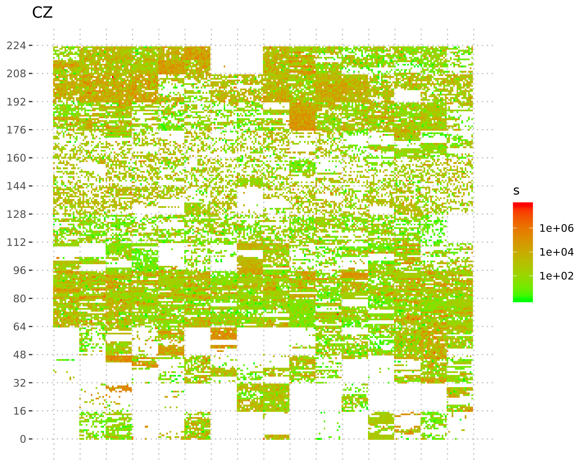

# plot_octets()

Plots a heatmap with first two octets of an IP address.

Created during hackathon @ Centr 13th R&D workshop, 27-28.11.2018, Leiden, NL

# Usage

### Generating plot ###

```R
require(dplyr)
require(sparklyr)
require(ggplot2)

sc <- sparklyr::spark_connect(...)

tbl_in <- spark_read_csv(sc, "tbl_in","hdfs:///tmp/sources.csv",delimiter = ";") # a CSV file with "src" and "count" columns

plot_octets(tbl_in)

```


### Generating animated GIF ###

```R
plot_octets(tbl_in1) + ggtitle("Dataset 1") + ggsave("1.png")
plot_octets(tbl_in2) + ggtitle("Dataset 2") + ggsave("2.png")
```

```bash
convert -delay 100 -loop 0 *.png animation.gif
```



